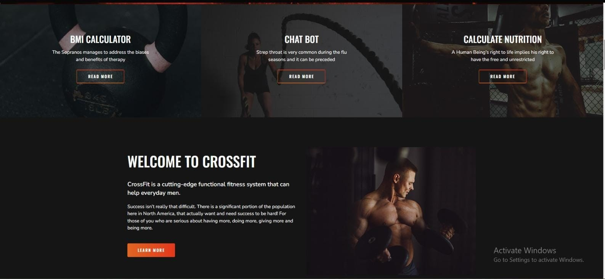

# THANOS

## Project Definition
*'THANOS' is a AI/AGI powered web application to maintain physical well-being , it is a versatile web application designed to revolutionize the fitness industry. It offers a range of services to cater to various fitness needs, including personalized training, diet planning, workout demonstrations, AI-driven chat support, metabolic rate calculations, and a dedicated e-commerce platform for gym enthusiasts.

# Services
- Fitness Trainer
- Diet Chart Generator
- Video Workout Demonstrator
     - Endomorph
     - Ectomorph
     - Mesomorph
- AGI powered Chatbot
- BMR Calculator
- Gym E-Commerce

## Screenshots

*Interface of Our Project.*

## Requirements
- Python 3.8.10
- Django 3.2.12
- VS Code Editor
- Internet Connection
- pip

## How to Execute
To run this project, follow these steps:

1. Clone the repository:
 git clone https://github.com/hajeeth/THANOS.git

2. Navigate to the project directory: cd THANOS

3. pip install pipenv

4. pipenv install django

5. pipenv shell

6. python manage.py runserver

